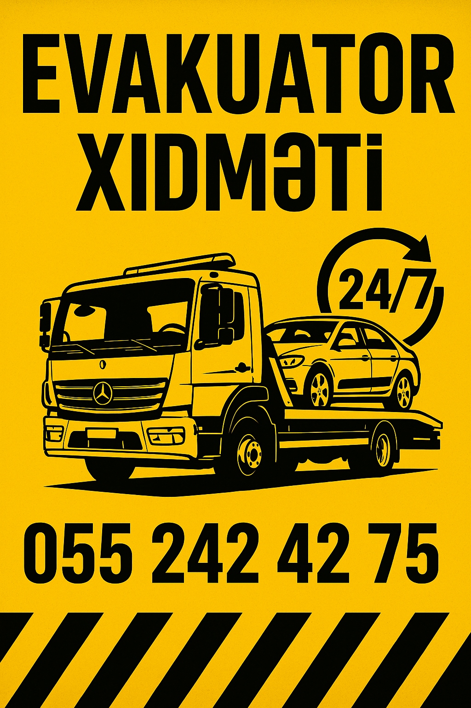

<html lang="az">
<head>
  <meta charset="UTF-8">
  <meta name="viewport" content="width=device-width, initial-scale=1.0">
  <title>Tez Yardım Evakuator</title>
  
</head>
<body>
<body>

<header style="text-align: center; padding: 20px;">
  
</header>
  <header>
    <h1>Tez Yardım Evakuator</h1>
    
Gəncə və ətrafında 24/7 xidmətinizdəyik

  </header>

  

    Sürətli və etibarlı evakuator xidməti!
  

  

    
    
     
    
    
    
    
  

  

    <h2>Xidmətlərimiz</h2>
    <ul>
      <li>24 saat evakuator xidməti</li>
      <li>Gəncə və ətraf rayonlara operativ xidmət</li>
      <li>Sərfəli qiymətlərlə avtomobil daşınması</li>
    </ul>
  

  <a class="call-button" href="tel:+994552424275">Zəng et: +994 55 242 42 75</a>

  

  <footer>
    © 2025 Tez Yardım Evakuator - Bütün hüquqlar qorunur.
  </footer>

  

</body>
</html>
