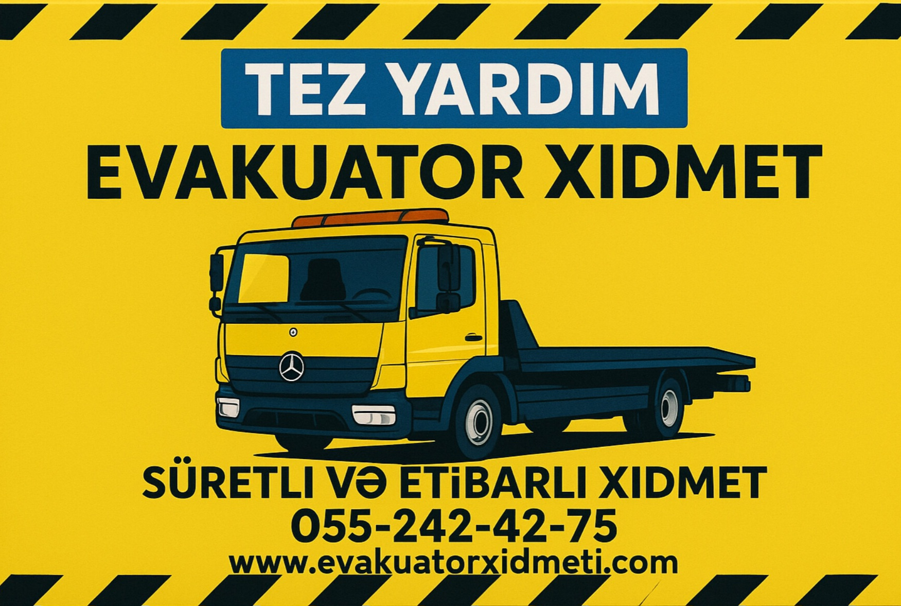
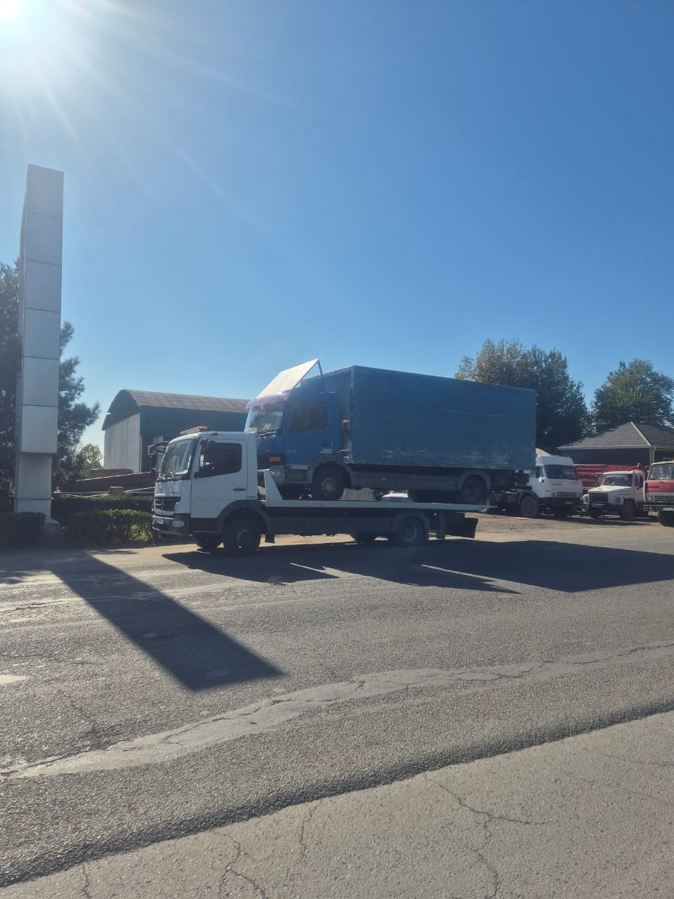

<html lang="az">
<head>
  <link rel="icon" type="image/x-icon" href="favicon.ico">
  <meta charset="UTF-8">
  <meta name="language" content="az">
  <meta http-equiv="Content-Language" content="az">
  <title>Evakuator Xidməti Gəncə və ətraf bölgələrdə</title>
  
  <head>
  <meta charset="UTF-8" />
  <title>Gəncə Evakuator Xidməti | 24/7 Yükdaşıma, Yükləmə-yük boşaltma və Avtomobil Daşıma</title>
  <meta name="description" content="Gəncə və ətraf bölgələrdə 24/7 evakuator xidməti. Sürətli, sərfəli və peşəkar yükdaşıma. Zəng edin: 055 242 42 75">
  <meta name="keywords" content="
    gəncə evakuator,
    evakuator xidməti,
    evakuator xidmeti,
    evakator,
    gence maşın,
    evakuator gence,
    Gence yuk dasıma,
    yuk daşıma,
    Evakuator sərfəli,
    evakuator serfeli,
    maşın daşıma,
    maşın yükleme,
    masin dasıma,
    evakator xidmeti,
    1 evakuator,
    evakuator gəncə,
    evakuator xıdmatı,
    evakuator xıdmetı,
    эвакуатор,
    эвакуатор баку,
    .
    avto 
    avtoqeza,
    evakuator, 
    qeza xidmeti,
    yükdaşıma gəncə,
    055 242 42 75 evakuator,
    maşın daşıma xidməti,
    avtomobil evakuator,
    təcili evakuator,
    ən yaxın evakuator,
    evakuator qiymətləri,
    evakuator sifarişi,
    gəncə avtomobil daşıma,
    evakuator 24/7,
    evakuator nömrəsi gəncə,
    evakuator xidməti gəncə,
    maşın evakuatoru,
    avtomobil təxliyəsi,
    avtomobil köməyi,
    gəncə maşın evakuator
    Qarabağ evakuator xidmeti 
  ">
  <meta name="author" content="Evakuator Xidməti Gəncə">
  <meta name="robots" content="index, follow" />
  <link rel="canonical" href="https://evakuatorxidmeti.github.io" />
  <meta name="viewport" content="width=device-width, initial-scale=1.0" />

  <!-- Logo və favicon -->
  <link rel="icon" href="/logo.png" type="image/png" />

  <!-- Sosial şəbəkə üçün (Open Graph) -->
  <meta property="og:title" content="Gəncə Evakuator Xidməti - 055 242 42 75" />
  <meta property="og:description" content="Gəncədə 24 saat fəaliyyət göstərən evakuator və yükdaşıma xidməti." />
  <meta property="og:image" content="https://evakuatorxidmeti.github.io/logo.png" />
  <meta property="og:url" content="https://evakuatorxidmeti.github.io" />
  <meta property="og:type" content="website" />
</head>
  <meta charset="UTF-8">
  <meta name="viewport" content="width=device-width, initial-scale=1.0">
  <title>Tez Yardım Evakuator</title>
   <title>Evakuator xidmeti</title>
  <title>Evakuasiya</title>
  <title>Evakuator xidmeti Gəncə</title>
  <title>Yük daşıma/konteyner daşıma</title>
  <title>Qəza daşınması</title>
  <title>Evakuator Xidməti  | 24/7 Peşəkar və Sürətli Xidmət</title>
<meta name="description" content="Gəncə və ətrafında 7/24 münasib qiymətə evakuator xidməti. Zəng edin və dərhal yardım alın. Sərfəli və etibarlı evakuasiya.">
  
<head>
<body>
<body>

<header style="text-align: center; padding: 20px;">
  
</header>
  <header>
    <h1>Tez Yardım Evakuator</h1>
    
Gəncə və ətraf bölgələrdə və Qarabağda 24/7 xidmətinizdəyik

  </header>

  

    Sürətli və etibarlı evakuator xidməti!
  

  

    
    
     
    
    
    
    
    
  

  

    <h2>Xidmətlərimiz</h2>
    <ul>
      <li>24 saat evakuator xidməti</li>
      <li>Gəncə və ətraf bölgələrdə və Qarabağda operativ xidmət</li>
      <li>Sərfəli qiymətlərlə avtomobil daşınması</li>
      <li>Düz platforma ilə müxtəlif yüklərin rahat daşınılması</li>
    </ul>
  

  <a class="call-button" href="tel:+994552424275">Zəng et: +994 55 242 42 75</a>

  

<section style="padding: 20px; max-width: 800px; margin: auto; text-align: center;">
  <h2>Haqqımızda</h2>
  

    <strong>Tez Yardım Evakuator</strong> olaraq, Gəncə və ətraf bölgələrdə və Qarabağda operativ və etibarlı evakuator xidməti təqdim edirik.
    Məqsədimiz sürücülərə ehtiyac anında vaxtında və təhlükəsiz şəkildə yardım etməkdir.
  

  

    Biz sizin güvəninizə layiq olmaq üçün çalışırıq. Sürətli reaksiya, münasib qiymət və peşəkar yanaşma ilə hər zaman xidmətinizdəyik.
    Xidmətimiz günün 24 saatı aktivdir.
  

  

    Əgər avtomobiliniz yolda qalıbsa və yardıma ehtiyacınız varsa – biz buradayıq. Sadəcə zəng edin!
  

</section>
  <footer>
    © 2025 Tez Yardım Evakuator - Bütün hüquqlar qorunur.
  </footer>
<footer>
  
  

    Bizi Instagram-da izləyin: 
    
  

</footer>
  

</body>

